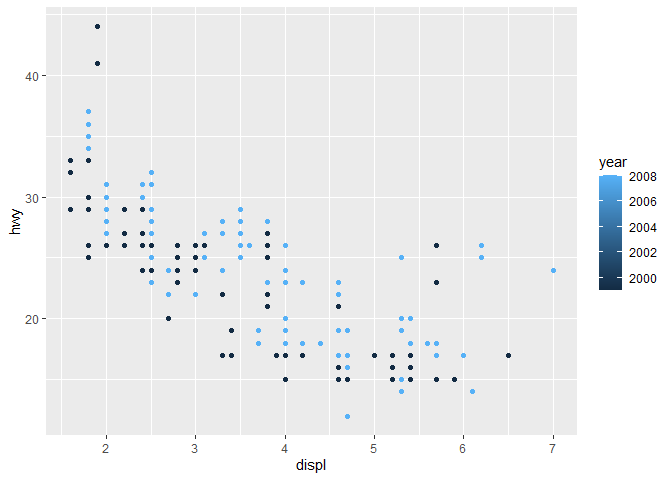
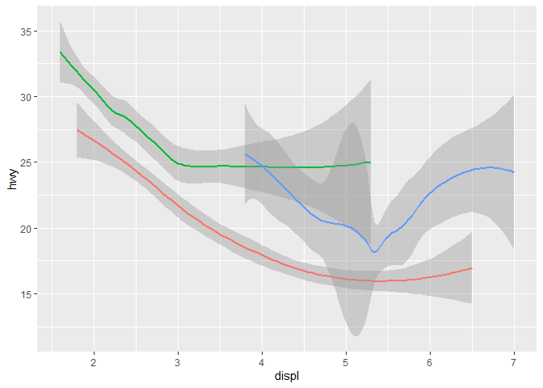
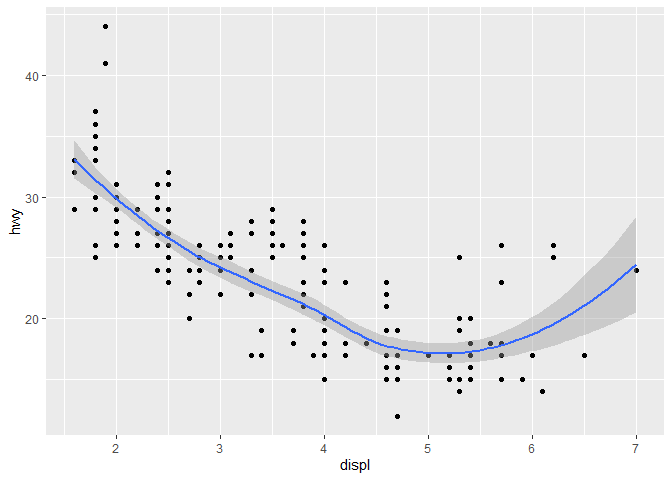
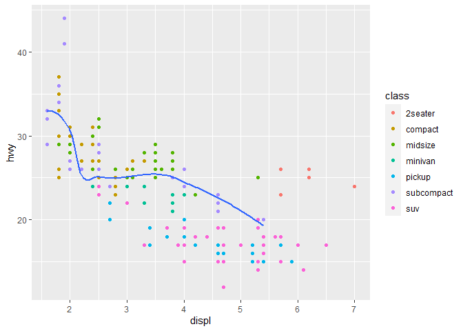
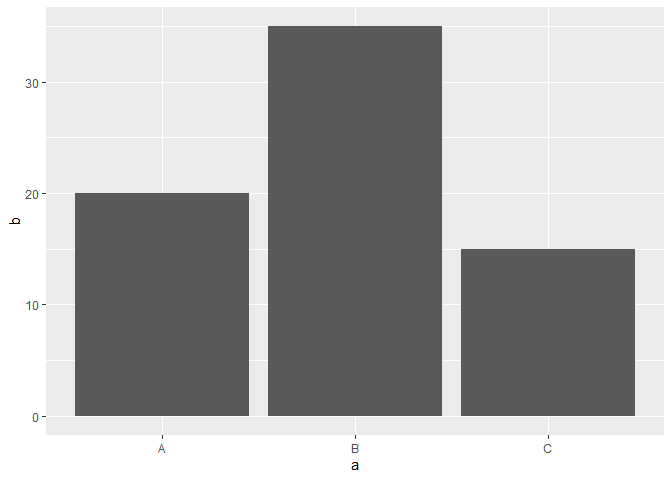
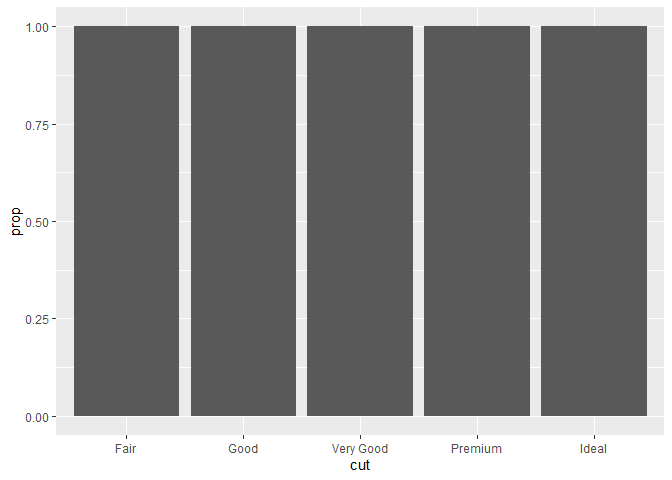
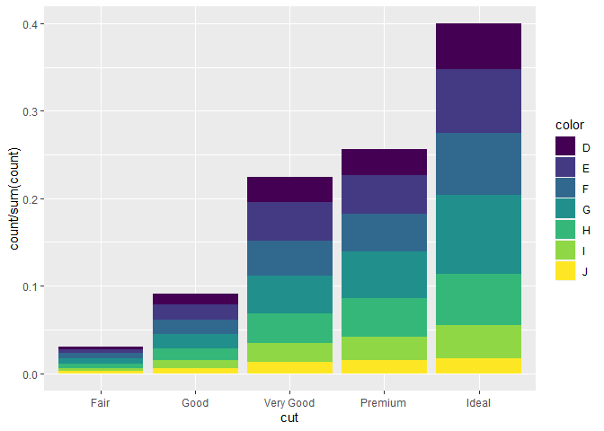

Data Visualization with ggplot
================

loading tidyverse

``` r
library(tidyverse)
```

    ## ── Attaching packages ─────────────────────────────────────── tidyverse 1.3.2 ──
    ## ✔ ggplot2 3.3.6      ✔ purrr   0.3.5 
    ## ✔ tibble  3.1.8      ✔ dplyr   1.0.10
    ## ✔ tidyr   1.2.1      ✔ stringr 1.4.1 
    ## ✔ readr   2.1.3      ✔ forcats 0.5.2 
    ## ── Conflicts ────────────────────────────────────────── tidyverse_conflicts() ──
    ## ✖ dplyr::filter() masks stats::filter()
    ## ✖ dplyr::lag()    masks stats::lag()

Creates an empty graph

``` r
ggplot(data = mpg)
```

<!-- -->

geom_point() adds a layer of points to your plot aes() specify variables
to map to x and y-axes

``` r
ggplot(data = mpg) +
  geom_point(mapping = aes(x = displ, y = hwy))
```

<!-- -->

number of rows and columns

``` r
nrow(mtcars)
```

    ## [1] 32

``` r
ncol(mtcars)
```

    ## [1] 11

documentation

``` r
?mpg
```

    ## starting httpd help server ... done

a scatterplot of hwy versus cyl

``` r
ggplot(data = mpg) +
  geom_point(mapping = aes(x = cyl, y = hwy))
```

<!-- -->

scatterplot of class versus drv

``` r
ggplot(data = mpg) +
  geom_point(mapping = aes(x = class, y = drv))
```

<!-- -->

Scaling: Assigning unique level of aesthetic to each unique value of the
variable.

Aesthetic color

``` r
ggplot(data = mpg) +
  geom_point(mapping = aes(x = displ, y = hwy, color = class))
```

<!-- -->

Aesthetic size

``` r
ggplot(data = mpg) +
  geom_point(mapping = aes(x = displ, y = hwy, size = class))
```

    ## Warning: Using size for a discrete variable is not advised.

<!-- -->

Aesthetic aplha (for transparency)

``` r
ggplot(data = mpg) +
  geom_point(mapping = aes(x = displ, y = hwy, alpha = class))
```

    ## Warning: Using alpha for a discrete variable is not advised.

<!-- -->

Aesthetic shape

``` r
ggplot(data = mpg) +
  geom_point(mapping = aes(x = displ, y = hwy, shape = class))
```

    ## Warning: The shape palette can deal with a maximum of 6 discrete values because
    ## more than 6 becomes difficult to discriminate; you have 7. Consider
    ## specifying shapes manually if you must have them.

    ## Warning: Removed 62 rows containing missing values (geom_point).

<!-- -->

Manually setting aesthetic properties

``` r
ggplot(data = mpg) +
  geom_point(mapping = aes(x = displ, y = hwy), color = "purple")
```

<!-- -->

Mapping a continuous variable to color and size. Continuous variables
cannot be mapped to shape

``` r
ggplot(data = mpg) +
  geom_point(mapping = aes(x = displ, y = hwy, color = year))
```

<!-- -->

``` r
ggplot(data = mpg) +
  geom_point(mapping = aes(x = displ, y = hwy, size = year))
```

<!-- -->

``` r
ggplot(data = mpg) +
  geom_point(mapping = aes(x = displ, y = hwy, color = hwy, size = displ))
```

<!-- -->

Mapping multiple aesthetics to same variable

``` r
ggplot(data = mpg) +
  geom_point(mapping = aes(x = displ, y = hwy, color = class, size = class, shape = class))
```

    ## Warning: Using size for a discrete variable is not advised.

    ## Warning: The shape palette can deal with a maximum of 6 discrete values because
    ## more than 6 becomes difficult to discriminate; you have 7. Consider
    ## specifying shapes manually if you must have them.

    ## Warning: Removed 62 rows containing missing values (geom_point).

<!-- -->

Stroke aesthetic

``` r
ggplot(data = mpg) +
  geom_point(mapping = aes(x = displ, y = hwy), shape = 21, color = "purple", fill = "yellow", size = 4, stroke = 2)
```

<!-- -->

Conditional operation

``` r
ggplot(data = mpg) +
  geom_point(mapping = aes(x = displ, y = hwy, color = displ < 5))
```

<!-- -->

Facet_wrap(): variable passed should be discrete

will only produce plots for the combinations of variables that have
values

``` r
ggplot(data = mpg) +
  geom_point(mapping = aes(x = displ, y = hwy)) +
  facet_wrap(~ class, nrow = 2)
```

<!-- -->

facet_grid() will produce a grid of plots for each combination of
variables that you specify, even if some plots are empty.

``` r
ggplot(data = mpg) +
  geom_point(mapping = aes(x = displ, y = hwy)) +
  facet_grid(drv ~ cyl)
```

<!-- -->

Facet on a continuous variable plot contains a facet for each distinct
value

``` r
ggplot(data = mpg) +
  geom_point(mapping = aes(x = displ, y = hwy)) +
  facet_wrap(~ cty)
```

<!-- -->

``` r
ggplot(data = mpg) +
  geom_point(mapping = aes(x = displ, y = hwy)) +
  facet_grid(~ cty)
```

<!-- -->
drv \~ . facet by values of drv on the y-axis.

``` r
ggplot(data = mpg) +
  geom_point(mapping = aes(x = displ, y = hwy)) +
  facet_grid(drv ~ .)
```

<!-- -->

. \~ cyl will facet by values of cyl on the x-axis

``` r
ggplot(data = mpg) +
  geom_point(mapping = aes(x = displ, y = hwy)) +
  facet_grid(. ~ cyl)
```

<!-- -->

Geometrical Object A geom is the geometrical object that a plot uses to
represent data.

``` r
ggplot(data = mpg) +
  geom_point(mapping = aes(x = displ, y = hwy))
```

<!-- -->

geom_smooth()

``` r
ggplot(data = mpg) +
  geom_smooth(mapping = aes(x = displ, y = hwy))
```

    ## `geom_smooth()` using method = 'loess' and formula 'y ~ x'

<!-- -->

linetype in geom_smooth()

geom_smooth() separates the cars into three lines based on their drv
value

``` r
ggplot(data = mpg) +
  geom_smooth(mapping = aes(x = displ, y = hwy, linetype = drv))
```

    ## `geom_smooth()` using method = 'loess' and formula 'y ~ x'

<!-- -->

group aesthetic

``` r
ggplot(data = mpg) +
  geom_smooth(mapping = aes(x = displ, y = hwy, group = drv))
```

    ## `geom_smooth()` using method = 'loess' and formula 'y ~ x'

<!-- -->

``` r
ggplot(data = mpg) +
  geom_smooth(
    mapping = aes(x = displ, y = hwy, color = drv),
    show.legend = FALSE
  )
```

    ## `geom_smooth()` using method = 'loess' and formula 'y ~ x'

<!-- -->

Add multiple geom functions

``` r
ggplot(data = mpg) +
  geom_point(mapping = aes(x = displ, y = hwy)) +
  geom_smooth(mapping = aes(x = displ, y = hwy))
```

    ## `geom_smooth()` using method = 'loess' and formula 'y ~ x'

<!-- -->

More efficient way

``` r
ggplot(data = mpg, mapping = aes(x = displ, y = hwy)) +
  geom_point() +
  geom_smooth()
```

    ## `geom_smooth()` using method = 'loess' and formula 'y ~ x'

<!-- -->

``` r
ggplot(data = mpg, mapping = aes(x = displ, y = hwy)) +
  geom_point(mapping = aes(color = class)) +
  geom_smooth()
```

    ## `geom_smooth()` using method = 'loess' and formula 'y ~ x'

<!-- -->

filter

se: Computes standard error of the mean.

``` r
ggplot(data = mpg, mapping = aes(x = displ, y = hwy)) +
  geom_point(mapping = aes(color = class)) +
  geom_smooth(
    data = filter(mpg, class == 'subcompact'),
    se = FALSE
  )
```

    ## `geom_smooth()` using method = 'loess' and formula 'y ~ x'

<!-- -->

``` r
ggplot(data = mpg, mapping = aes(x = displ, y = hwy, color = drv)) +
  geom_point() +
  geom_smooth(se = FALSE)
```

    ## `geom_smooth()` using method = 'loess' and formula 'y ~ x'

<!-- -->

Recreating graphs from exercise

``` r
ggplot(data = mpg, mapping = aes(x = displ, y = hwy)) +
  geom_point(size = 3) +
  geom_smooth(se = FALSE)
```

    ## `geom_smooth()` using method = 'loess' and formula 'y ~ x'

<!-- -->

``` r
ggplot(data = mpg, mapping = aes(x = displ, y = hwy)) +
  geom_point(size = 3) +
  geom_smooth(mapping = aes(group = drv), se = FALSE)
```

    ## `geom_smooth()` using method = 'loess' and formula 'y ~ x'

<!-- -->

``` r
ggplot(data = mpg, mapping = aes(x = displ, y = hwy, color = drv)) +
  geom_point(size = 3) +
  geom_smooth(se = FALSE)
```

    ## `geom_smooth()` using method = 'loess' and formula 'y ~ x'

<!-- -->

``` r
ggplot(data = mpg, mapping = aes(x = displ, y = hwy)) +
  geom_point(mapping = aes(color = drv), size = 3) +
  geom_smooth(se = FALSE)
```

    ## `geom_smooth()` using method = 'loess' and formula 'y ~ x'

<!-- -->

``` r
ggplot(data = mpg, mapping = aes(x = displ, y = hwy)) +
  geom_point(mapping = aes(color = drv), size = 3) +
  geom_smooth(mapping = aes(linetype = drv), se = FALSE)
```

    ## `geom_smooth()` using method = 'loess' and formula 'y ~ x'

<!-- -->

``` r
ggplot(data = mpg, mapping = aes(x = displ, y = hwy)) +
  geom_point(size = 3, color = 'white') +
  geom_point(mapping = aes(color = drv))
```

<!-- -->

Statistical Transformations

The algorithm used to calculate new values for a graph is called a stat.
default value for stat is “count”

geom_bar()

``` r
ggplot(dat = diamonds) +
  geom_bar(mapping = aes(x = cut))
```

<!-- -->

This works because every geom has a default stat, and every stat has a
default geom.

``` r
ggplot(dat = diamonds) +
  stat_count(mapping = aes(x = cut))
```

<!-- -->

identity

``` r
demo <- tribble(
  ~a,      ~b,
  "A", 20,
  "B", 35,
  "C", 15
)

ggplot(dat = demo) +
  geom_bar(mapping = aes(x = a, y = b), stat = 'identity')
```

<!-- -->

Bar chart of proportion

``` r
ggplot(data = diamonds) +
  geom_bar(
    mapping = aes(x = cut, y = ..prop.., group = 1)
  )
```

<!-- -->

stat_summary()

``` r
ggplot(data = diamonds) +
  stat_summary(
    mapping = aes(x = cut, y = depth),
    fun.min = min,
    fun.max = max,
    fun = median
  )
```

<!-- -->

``` r
?stat_summary
```

``` r
ggplot(data = diamonds) +
  geom_pointrange(
    mapping = aes(x = cut, y = depth),
    stat = 'summary',
    fun.min = min,
    fun.max = max,
    fun = median
  )
```

<!-- -->

If group = 1 is not included, all the bars will have the same height.

The function geom_bar() assumes that the groups are equal to the x
values since the stat computes the counts within the group.

``` r
ggplot(data = diamonds) +
  geom_bar(mapping = aes(x = cut, y = ..prop..))
```

<!-- -->

``` r
ggplot(data = diamonds) +
  geom_bar(
    mapping = aes(x = cut, fill = color, y = ..count.. / sum(..count..))
  )
```

<!-- -->
